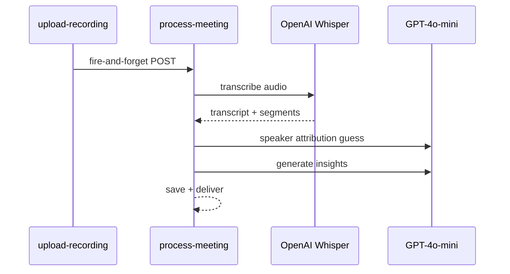
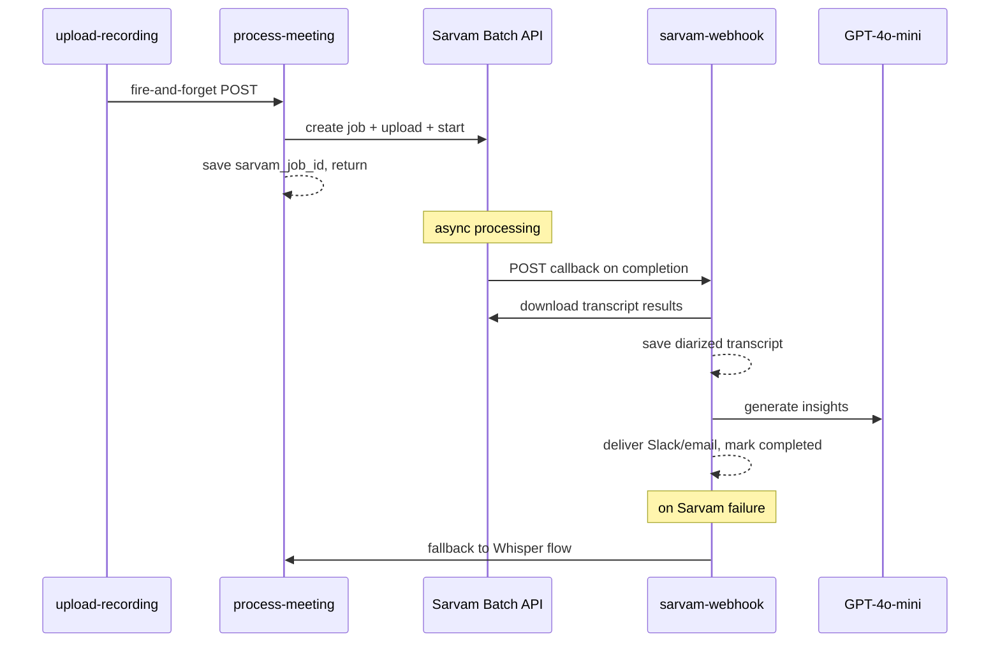

# Whisper to Sarvam STT Migration

## Locked Decisions

- **Mode**: `translate` for all meetings (English in = English out, Hindi/Hinglish in = English out)
- **Diarization**: Always on (`with_diarization: true`), auto-detect speaker count (omit `num_speakers`)
- **Speaker labels**: `SPEAKER_00`, `SPEAKER_01`, etc. (no rename UI yet)
- **Audio format**: Test WebM first; convert to WAV server-side only if Sarvam rejects it
- **Storage**: English transcript only (no `content_original` column)
- **Fallback**: Keep Whisper for retries if Sarvam fails
- **Async strategy**: Webhook callback to a new Edge Function

## Architecture Change

Current flow (synchronous, single function):

New flow (async, two functions):

## Files to Change

### 1. Database migration (new file)

Create `supabase/migrations/<timestamp>_sarvam_migration.sql`:

- Add `sarvam_job_id TEXT` to `meetings` table
- Add `language_detected TEXT` to `transcripts` table
- Add `stt_provider TEXT DEFAULT 'whisper'` to `transcripts` table

### 2. Modify process-meeting/index.ts

This function currently does everything (lines 1-622). Refactor it into two paths:

**Sarvam path (new, default):**

- Download audio from Supabase Storage (lines 101-113, keep as-is)
- Call Sarvam Batch API via raw REST (no SDK -- Deno doesn't have the npm package easily):
  1. `POST https://api.sarvam.ai/speech-to-text/job/v1` -- create job with `{ job_parameters: { model: "saaras:v3", mode: "translate", with_diarization: true, with_timestamps: true }, callback: { url: "<supabase-url>/functions/v1/sarvam-webhook", auth_token: "<secret>" } }`
  2. `POST https://api.sarvam.ai/speech-to-text/job/v1/upload-files` -- get presigned upload URL for the audio file
  3. `PUT <presigned_url>` -- upload the audio binary
  4. `POST https://api.sarvam.ai/speech-to-text/job/v1/{job_id}/start` -- kick off processing
- Save `sarvam_job_id` on the meeting row
- Store `slackDestination` and `sendEmail` preferences on the meeting row (or a new `meeting_processing_config` JSONB column) so the webhook function knows how to deliver
- Return immediately (meeting stays in `processing` status)

**Whisper path (existing, fallback):**

- Keep the current Whisper + GPT insight logic intact
- Wrap it in a function that can be called from both `process-meeting` (if Sarvam submit fails) and `sarvam-webhook` (if Sarvam job fails)

### 3. New Edge Function: sarvam-webhook/index.ts

Receives the callback from Sarvam when the batch job completes:

- Validate auth token from `X-SARVAM-JOB-CALLBACK-TOKEN` header
- Extract `job_id` and `job_state` from the webhook payload
- Look up the meeting by `sarvam_job_id`
- If `job_state === "COMPLETED"`:
  1. Call `POST https://api.sarvam.ai/speech-to-text/job/v1/download-files` to get presigned download URLs
  2. Fetch the transcript JSON from the download URL
  3. Parse the response: extract `transcript`, `diarized_transcript.entries[]`, `language_code`, `timestamps`
  4. Map diarized entries to `SpeakerSegment[]` format: `{ speaker: "SPEAKER_00", text: "...", start: 0.01, end: 2.5, speaker_id: "0" }`
  5. Run hallucination check (`isLikelyHallucination`) on transcript
  6. Save to `transcripts` table with `stt_provider: "sarvam"` and `language_detected`
  7. Build speaker-labeled transcript and run GPT-4o-mini insight generation (reuse existing prompt from `process-meeting`, lines 259-370)
  8. Save insights to `meeting_insights` table
  9. Deliver via Slack/email (reuse existing delivery logic, lines 457-600)
  10. Mark meeting as `completed`
- If `job_state === "FAILED"`:
  1. Log the error
  2. Fall back to Whisper: call `process-meeting` internally or inline the Whisper transcription logic
  3. Set `stt_provider: "whisper"` on the transcript

### 4. Shared utilities: _shared/sarvam.ts

Extract Sarvam API helpers to keep both functions clean:

- `createSarvamJob(apiKey, callbackUrl, callbackToken)` -- creates batch job
- `uploadToSarvamJob(apiKey, jobId, fileName, audioBlob)` -- gets presigned URL + uploads
- `startSarvamJob(apiKey, jobId)` -- starts processing
- `downloadSarvamResults(apiKey, jobId, fileName)` -- downloads transcript

### 5. Shared utilities: _shared/insights.ts

Extract the GPT-4o-mini insight generation + delivery logic from `process-meeting` (lines 225-600) so both `process-meeting` (Whisper fallback) and `sarvam-webhook` can reuse it:

- `generateInsights(openai, meeting, transcript, speakerSegments)` -- runs GPT-4o-mini
- `saveInsights(supabase, meetingId, insights)` -- saves to `meeting_insights`
- `deliverResults(supabase, meeting, insights, config)` -- Slack + email delivery

### 6. Update summarizer prompt

Small tweak to the existing system prompt in the insight generation (line 377):

- From: "You are an expert meeting analyst..."
- Add: "Speaker labels (SPEAKER_00, SPEAKER_01, etc.) are acoustically verified diarization labels. Use them confidently for attribution. If participant names are available from the attendee list, map SPEAKER_XX IDs to names where context makes it clear."

### 7. Environment variables

Add to Supabase project secrets:

- `SARVAM_API_KEY` -- Sarvam API subscription key
- `SARVAM_WEBHOOK_SECRET` -- shared secret for validating webhook callbacks

### 8. Audio format handling

In `process-meeting`, before uploading to Sarvam:

- First attempt: send the `.webm` file as-is with filename `audio.webm`
- If Sarvam returns a 422 (`unprocessable_entity_error` / "Unsupported audio format"):
  - Convert WebM to WAV using a WASM-based FFmpeg or a lightweight Deno audio conversion library
  - Re-upload as `audio.wav`
  - Log a warning so we know to default to conversion going forward

Per Sarvam docs, supported formats are: **WAV, MP3, AAC, FLAC, OGG**. WebM is not listed but `audio/opus` is a supported MIME type, so it may work since our WebM files use the Opus codec.

## What Does NOT Change

- Chrome extension recording logic (still captures WebM/Opus)
- `upload-recording` Edge Function (still uploads to Supabase Storage, still triggers `process-meeting`)
- Frontend dashboard, meeting detail views, transcript display components
- `meeting_insights` table schema
- GPT-4o-mini model choice for summarization
- Slack/email delivery format
